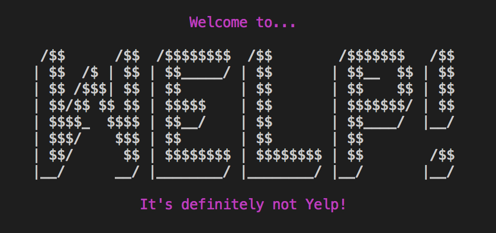

Flatiron School Module One Final Project: Welp
========================

This our Flatiron School Mod 1 final project--a command line CRUD app built with Ruby that allows users to place (imaginary) orders with restaurants, and keep track of their faves. 

User Stories
========================

- As a user, you can **Create**, **Update**, and **Delete** your user account.

- You can search for (aka **Read**) restaurants based on price, or a category of food. Or you an ask for a random restaurant suggestion and decide to order from it or not.

- After you place orders, you can rate the order, and choose to add the restaurant to your list of favorites.

- You can view the list of restaurants you've previously ordered from and re-order if you'd like.

- You can also view your favorites, and re-order or remove a restaurant from your list of favorites.

Models & API
========================

Our restaurants database is seeded from the [Yelp Fusion API](https://www.yelp.com/fusion).

Our models are User, Restaurant, and Order
  - a user has many restaurants, through orders
  - a restaurant has many users, through orders
  - an order belongs to a user, and a restaurant

Gems
========================

Additional command line styling provided by the [Colorize gem](https://github.com/fazibear/colorize) as well as the [Text-Table gem](https://github.com/aptinio/text-table).

Try it out!
========================

To play around with our project, you will need your own API key from Yelp Fusion. Fork and clone the repository, and use the [dotenv gem](https://github.com/bkeepers/dotenv) to help set up your .env file. Add .env to your `.gitignore` file. In the .env file, create a constant variable: APIKEY=\<your fusion api key>.

Then run `bundle install` in the terminal, and run `rake db:migrate` followeed by `rake db: seed` to set up your schema and seed the database. Then run the application through the run file `ruby bin/run.rb` 

Follow the prompts on the screen, and let us know if anything breaks!

---

